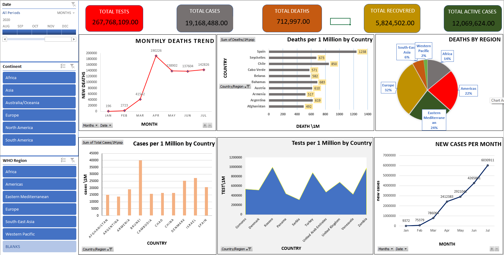

# 📊 COVID-19 Executive Dashboard | Microsoft Excel

> An interactive Excel dashboard designed to analyze COVID-19 cases, deaths, recoveries, testing, and regional trends using KPIs, PivotTables, PivotCharts, and interactive slicers.

---

## 🖥️ Dashboard Preview



---

## 📌 Project Overview

The **COVID-19 Executive Dashboard** is an interactive data analytics project developed in **Microsoft Excel**.

The dashboard transforms COVID-19 data into a structured and visually engaging report, allowing users to explore key statistics, trends, country-level comparisons, and regional patterns.

Interactive slicers make it possible to filter the dashboard by **Date, Continent, and WHO Region**, providing a flexible way to explore different segments of the dataset.

This project demonstrates practical skills in **Excel Data Analysis, Dashboard Development, PivotTables, PivotCharts, KPI Development, Data Visualization, and Interactive Reporting**.

---

## 🎯 Project Objectives

The main objectives of this project are to:

- Analyze COVID-19 cases, deaths, recoveries, and testing data
- Monitor key COVID-19 performance indicators
- Analyze monthly case and death trends
- Compare countries using per-million metrics
- Analyze deaths across WHO regions
- Build an interactive Excel dashboard
- Apply PivotTables and PivotCharts for data analysis
- Create a clear and executive-friendly data visualization
- Present analytical information in an easy-to-understand format

---

## 📊 Key Performance Indicators

The dashboard contains five major KPI cards:

| KPI | Description |
|---|---|
| 🧪 **Total Tests** | Total COVID-19 tests recorded |
| 🦠 **Total Cases** | Total confirmed COVID-19 cases |
| ⚰️ **Total Deaths** | Total reported COVID-19 deaths |
| 💚 **Total Recovered** | Total recovered cases |
| 🔴 **Total Active Cases** | Total active COVID-19 cases |

These KPIs provide a quick overview of the major statistics represented in the dataset.

---

## 📈 Dashboard Visualizations

### 1. 📉 Monthly Deaths Trend

A line chart showing the monthly trend of COVID-19 deaths.

**Focus:**
- Monthly death trends
- Changes over time
- Identification of increases and decreases

---

### 2. 📊 Deaths per 1 Million by Country

A horizontal bar chart comparing deaths per 1 million population across countries.

**Focus:**
- Country-level comparison
- Population-adjusted mortality analysis
- Comparison of deaths using a normalized metric

---

### 3. 🥧 Deaths by Region

A pie chart showing the distribution of deaths across WHO regions.

**Focus:**
- Regional distribution
- WHO region comparison
- Share of recorded deaths by region

---

### 4. 📊 Cases per 1 Million by Country

A column chart comparing COVID-19 cases per 1 million population across countries.

**Focus:**
- Country-level case comparison
- Population-adjusted case analysis
- Comparison of recorded cases between countries

---

### 5. 📈 Tests per 1 Million by Country

An area chart comparing COVID-19 testing levels per 1 million across countries.

**Focus:**
- Testing comparison
- Country-level testing patterns
- Population-adjusted testing analysis

---

### 6. 📈 New Cases per Month

A line chart displaying new COVID-19 cases by month.

**Focus:**
- Monthly case trends
- Changes in new cases
- Time-based analysis

---

## 🎛️ Interactive Dashboard Filters

The dashboard includes interactive slicers that allow users to dynamically filter the analysis.

### 📅 Date

The Date slicer allows users to explore the dashboard across different time periods.

### 🌍 Continent

The dashboard provides continent-level filtering, including:

- Africa
- Asia
- Australia/Oceania
- Europe
- North America
- South America

### 🌎 WHO Region

The dashboard provides WHO region filtering, including:

- Africa
- Americas
- Eastern Mediterranean
- Europe
- South-East Asia
- Western Pacific

---

## 🛠️ Tools & Technologies

| Tool / Technology | Purpose |
|---|---|
| **Microsoft Excel** | Dashboard development and data analysis |
| **PivotTables** | Data summarization and analysis |
| **PivotCharts** | Data visualization |
| **Slicers** | Interactive filtering |
| **Excel Formulas** | Calculations and analysis |
| **Data Visualization** | Presenting analytical insights |

---

## 🔄 Data Analytics Workflow

```text
Raw Data
   ↓
Data Preparation
   ↓
Data Analysis
   ↓
PivotTables
   ↓
PivotCharts
   ↓
Interactive Slicers
   ↓
Dashboard Development
   ↓
Data Visualization
   ↓
Insights
